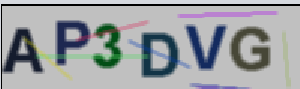
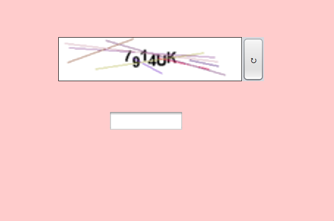

# 🛡️ Componentes-Captcha - Generador y Verificador de CAPTCHA con Swing

Este proyecto proporciona dos componentes personalizados en Java Swing para la generación y verificación de CAPTCHA. Está diseñado para integrarse fácilmente en interfaces gráficas (GUI) que requieran una verificación básica anti-bot.

---

## 🧩 Componentes principales

### 🔠 `CaptchaLabel` - Generador de CAPTCHA

Este componente extiende `JLabel` y genera una imagen CAPTCHA visualmente distorsionada con texto aleatorio, líneas de ruido y desenfoque, dificultando así su lectura automatizada.

#### Funcionalidades:
- Texto aleatorio de 8 caracteres (sin letras ni números ambiguos).
- Renderizado gráfico con:
  - Fuente Arial, tamaño 40pt, negrita.
  - Color aleatorio por carácter (tonos oscuros).
  - Líneas de ruido visual (8 por imagen).
  - Filtro de desenfoque (`ConvolveOp` con kernel 3x3).
- Redibujado automático con `repaint()`.
- Tamaño fijo de 200x60 píxeles.
- Basado completamente en bibliotecas estándar (`AWT`, `Swing`).

---

### ✍️ `CaptchaTextField` - Verificador de CAPTCHA

Este componente extiende `JTextField` e implementa `ActionListener` para detectar la acción de presionar `Enter`. Compara el texto ingresado con el CAPTCHA generado y responde en consecuencia.

#### Comportamiento:
1. El usuario escribe el texto del CAPTCHA.
2. Al presionar `Enter`, se verifica la coincidencia:
   - ✅ Si es **correcto**: muestra un mensaje de éxito.
   - ❌ Si es **incorrecto**: muestra un error, genera un nuevo CAPTCHA y limpia el campo.

#### Detalles técnicos:
- Implementa `ActionListener`.
- Comparación insensible a mayúsculas/minúsculas (`equalsIgnoreCase`).
- Utiliza el método `setCaptchaLabel(CaptchaLabel)` para integrarse.

---

# CaptchaLabel - Generador de CAPTCHA en Java

Este componente en Java genera una imagen CAPTCHA personalizada, utilizando `JLabel` de Swing, que puede integrarse fácilmente en interfaces gráficas de usuario (GUI). La imagen contiene texto aleatorio con ruido visual y un filtro de desenfoque para aumentar su seguridad.

## 🧩 Características

- ✅ Generación aleatoria de texto CAPTCHA (8 caracteres).
- 🎨 Renderizado gráfico con distorsión, ruido visual y color aleatorio por carácter.
- 🌫️ Aplicación de un filtro de desenfoque (blur) sobre la imagen.
- 🔁 Componente reutilizable con capacidad de regenerar CAPTCHA dinámicamente.
- 🧱 Basado en la biblioteca estándar de Java (AWT y Swing).

## 📷 Vista previa (simulada)



## ⚙️ Detalles técnicos

- **Fuente utilizada:** Arial, 40pt, negrita.
- **Colores:** Aleatorios por carácter, usando tonos oscuros.
- **Ruido visual:** 8 líneas dibujadas con colores aleatorios para dificultar la lectura automatizada.
- **Desenfoque:** Aplicado mediante `ConvolveOp` con un kernel de 3x3 (promedio), para suavizar la imagen.
- **Tamaño del componente:** 200x60 píxeles.
- **Caracteres válidos:** Letras mayúsculas sin ambigüedad (`A-Z` sin `O`, `I`) y números (`2-9`, sin `0`, `1`).

## 🧩 Métodos y Constructor de `CaptchaLabel`

### 🛠️ Constructor

#### `public CaptchaLabel()`
Crea una instancia del componente CAPTCHA con tamaño fijo de `200x60` píxeles. Establece un borde negro y genera un CAPTCHA inicial automáticamente al momento de crear el objeto.

---

### 🔄 Métodos públicos

#### `public void generarCaptcha()`
Genera un nuevo texto aleatorio de CAPTCHA y lo convierte en una imagen con ruido y desenfoque. Llama a `repaint()` para actualizar la visualización del componente.

#### `public String getTexto_Captcha()`
Devuelve el texto actual generado del CAPTCHA, útil para verificar la entrada del usuario en otro componente.

---

### 🔒 Métodos privados

#### `private String generarTextoCaptcha(int Tamaño)`
Genera una cadena aleatoria con la longitud indicada. Los caracteres válidos son letras mayúsculas sin ambigüedad (`A-Z` sin `O`, `I`) y números (`2-9`), lo que facilita la legibilidad por humanos.

#### `private BufferedImage generarImagen_delCaptcha(String text)`
Convierte el texto CAPTCHA en una imagen:
- Pinta el fondo con gris claro.
- Dibuja cada carácter con una posición y color aleatorio.
- Añade 8 líneas de ruido visual con colores aleatorios.
- Aplica un desenfoque con un `Kernel` de 3x3 para dificultar su lectura por bots.

---

### 🎨 Método sobreescrito

#### `protected void paintComponent(Graphics g)`
Sobrescribe el método de `JLabel` para dibujar la imagen generada del CAPTCHA sobre el componente. Se asegura de que la imagen se actualice cada vez que se llama a `repaint()`.

---

# CaptchaTextField - Campo de texto con verificación de CAPTCHA en Java

Este componente extiende `JTextField` y se conecta a un `CaptchaLabel` para verificar automáticamente si el texto ingresado por el usuario coincide con el CAPTCHA generado.

## 🔐 Funcionalidad

- 📥 Campo de texto que escucha acciones (`Enter`) del usuario.
- 🔍 Verifica automáticamente el texto ingresado con el CAPTCHA.
- 🔄 Si la verificación falla, genera un nuevo CAPTCHA y limpia el campo.
- 🖥️ Diseñado para trabajar junto con el componente `CaptchaLabel`.

  
## 🔗 Dependencia

Este componente **requiere** una instancia de `CaptchaLabel` para funcionar correctamente.

## 🚀 Cómo usar

### Crear e integrar los componentes

```java
CaptchaLabel captcha = new CaptchaLabel();
CaptchaTextField textField = new CaptchaTextField();
textField.setCaptchaLabel(captcha);

JPanel panel = new JPanel();
panel.add(captcha);
panel.add(textField);
```
## 🧾 Comportamiento

- El usuario escribe el texto del CAPTCHA.
- Al presionar `Enter`, se compara el texto ingresado con el generado.
- Se muestra un `JOptionPane` con el resultado:

  - ✅ **Correcto:** se notifica al usuario.
  - ❌ **Incorrecto:** se genera uno nuevo y se reinicia el campo.

## ⚙️ Detalles técnicos

- **Herencia:** extiende `JTextField`.
- **Listener:** implementa `ActionListener` para detectar eventos de texto.
- **Comparación:** insensible a mayúsculas/minúsculas (`equalsIgnoreCase`).
- **Integración:** usa el método `setCaptchaLabel(CaptchaLabel label)` para vincular CAPTCHA.

## 🧩 Métodos y Constructor de `CaptchaTextField`

### 🛠️ Constructor

#### `public CaptchaTextField()`
Inicializa un campo de texto (`JTextField`) con un ancho de 10 columnas. Registra el componente como su propio `ActionListener` para detectar cuando el usuario presiona `Enter`. Limpia el texto inicial del campo.

---

### 🔗 Método de vinculación

#### `public void setCaptchaLabel(CaptchaLabel captchaLabel)`
Asigna una instancia de `CaptchaLabel` al campo de texto. Es esencial para que la verificación del CAPTCHA funcione correctamente, ya que este método enlaza el campo con la fuente de datos a verificar.

---

### 🔁 Método sobrescrito

#### `@Override public void actionPerformed(ActionEvent e)`
Este método se ejecuta cuando el usuario presiona `Enter` en el campo. Si el `CaptchaLabel` fue previamente asignado, llama a `verificarCaptcha()`. Si no, muestra un mensaje de error con `JOptionPane`.

---

### 🧪 Método de verificación

#### `private void verificarCaptcha()`
Compara el texto ingresado por el usuario con el CAPTCHA generado:
- Si el texto es **correcto**, se muestra un mensaje de éxito.
- Si es **incorrecto**, se notifica al usuario, se genera un nuevo CAPTCHA desde `CaptchaLabel`, y el campo de texto se reinicia.

La comparación es insensible a mayúsculas/minúsculas (`equalsIgnoreCase`) para facilitar la experiencia del usuario.

# 🖥️ Aplicacion_Componentes - Interfaz Gráfica de Prueba para CAPTCHA

`Aplicacion_Componentes` es una clase que extiende `JFrame` y actúa como una interfaz de prueba para los componentes personalizados `CaptchaLabel` y `CaptchaTextField`. Esta aplicación proporciona una ventana gráfica funcional que simula un escenario real de verificación de CAPTCHA usando Java Swing.

---

## 🎯 Funcionalidad principal

- Muestra un CAPTCHA generado aleatoriamente (`CaptchaLabel`).
- Permite al usuario ingresar el texto del CAPTCHA en un campo de texto (`CaptchaTextField`).
- Verifica automáticamente la entrada al presionar `Enter`.
- Ofrece un botón para **refrescar el CAPTCHA manualmente**.

---

## 🧩 Componentes usados

| Componente           | Descripción                                                                 |
|----------------------|-----------------------------------------------------------------------------|
| `CaptchaLabel`       | Componente gráfico que muestra el CAPTCHA generado.                        |
| `CaptchaTextField`   | Campo de texto personalizado que verifica automáticamente la entrada del usuario. |
| `JButton - Refrescar`| Botón que permite generar un nuevo CAPTCHA manualmente.                    |

---

## ⚙️ Detalles de implementación

### 🏗️ Constructor

```java
public Aplicacion_Componentes()
Inicializa la ventana gráfica, establece los componentes y enlaza el campo de texto con el CAPTCHA mediante setCaptchaLabel(captchaLabel1). Además, limpia el campo de texto al inicio.
```

### 🧪 Logica de verificación
El campo de texto (CaptchaTextField) se conecta al CaptchaLabel para que, al presionar Enter, verifique automáticamente el texto ingresado.
Si la verificación falla, el propio componente se encarga de mostrar un mensaje y generar un nuevo CAPTCHA.

### 🔁 Funcionalidad del botón Refrescar
```java
private void RefrescarbtnActionPerformed(ActionEvent evt)
```
Este método genera manualmente un nuevo CAPTCHA al presionar el botón y limpia el campo de entrada para permitir un nuevo intento.

### 🖼️ Diseño gráfico
La ventana contiene los siguientes elementos organizados con GroupLayout dentro de un JPanel:
Imagen CAPTCHA al centro.
Campo de texto justo debajo.
Botón para refrescar el CAPTCHA en la parte inferior.
🎨 Fondo rosado claro (RGB: 255, 204, 204) y botón verde claro para mejorar la visibilidad del CAPTCHA.

## 📷 Vista previa (simulada)


---
# 📦 Instalación de los Componentes CAPTCHA
1. **Clona o copia los archivos de clase:**
   - `CaptchaLabel.java`
   - `CaptchaTextField.java`

2. **Agrega las clases a tu proyecto Java Swing** dentro del paquete `Captcha_Componentes` o el nombre de paquete que prefieras (recuerda modificar las importaciones si cambias el nombre).

3. **Crea una ventana o formulario** (`JFrame`) donde usarás los componentes.

4. **Agrega e inicializa los componentes en tu clase principal:**

```java
CaptchaLabel captcha = new CaptchaLabel();
CaptchaTextField textField = new CaptchaTextField();
textField.setCaptchaLabel(captcha); // Conexión entre el campo y la imagen

JPanel panel = new JPanel();
panel.add(captcha);
panel.add(textField);
```
## 🧩 Agregar Componentes a la Paleta de NetBeans

Esta guía te explica cómo integrar los componentes personalizados `CaptchaLabel` y `CaptchaTextField` en la paleta de NetBeans para que puedas arrastrarlos y usarlos visualmente desde el GUI Builder.

---
### 1. Compila el proyecto ###

Asegúrate de que tu proyecto esté compilado correctamente para que NetBeans pueda detectar las clases:
---

### 2. Abre la paleta de componentes

1. Abre cualquier formulario (`.java`) que use Swing con el diseñador gráfico.
2. En el borde derecho, ubica la **Paleta** (si no se ve, ve a `Window → Palette`).

---

### 3. Agrega un nuevo componente

1. En la parte superior de la paleta, haz clic en el icono **"Agregar desde archivo JAR o Clase"** (ícono de engranaje o clic derecho sobre la paleta → `Add from JAR...` o `Add from Project Class`).
2. Selecciona la clase personalizada:
   - Busca `CaptchaLabel.class` o `CaptchaTextField.class` desde el directorio `build/classes/Captcha_Componentes` o donde esté compilado tu `.class`.
   - También puedes navegar hasta el archivo `.java` si eliges “Add from Project Class”.

---

### 4. Selecciona la categoría

- NetBeans te preguntará en qué categoría de la paleta agregar los componentes.
- Puedes crear una nueva, por ejemplo: `Captcha Componentes`.

---

### 5. ¡Listo! Usa tus componentes

- Ahora podrás arrastrar `CaptchaLabel` y `CaptchaTextField` directamente desde la paleta al formulario visual.
- El código generado automáticamente usará tus clases personalizadas.

---
